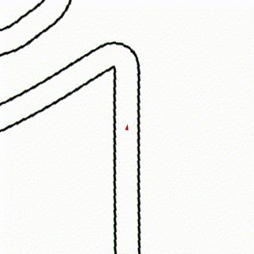
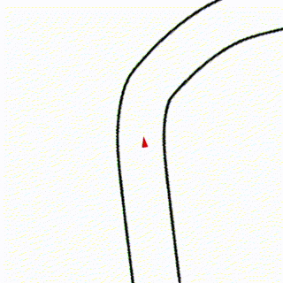

# F1-RL

Final project for [CSE 579: Intelligent Control Through Learning And Optimization](https://courses.cs.washington.edu/courses/cse579/22au/), by [Abhay Deshpande](https://github.com/abhaybd) and [Arnav Thareja](https://github.com/arnavthareja).

This project uses deep reenforcement learning to race 1/10th-scale F1 cars in simulation. The full project report is attached [here](assets/ProjectReport.pdf). The trained agents succesfully learned to race competitively.

Interestingly, the agent was trained on [COTA](https://en.wikipedia.org/wiki/Circuit_of_the_Americas) (left) and was able to transfer to new tracks, such as [Interlagos](https://en.wikipedia.org/wiki/Interlagos_Circuit) (right).




## Installation instructions

Clone repo:
```bash
git clone https://github.com/abhaybd/F1-RL.git
cd F1-RL
```

Create environment

```bash
conda env create -f env.yaml
conda activate f1-rl
```

Now install f1tenth gym

```bash
git clone https://github.com/f1tenth/f1tenth_gym.git
cd f1tenth_gym
pip install -e .
```
